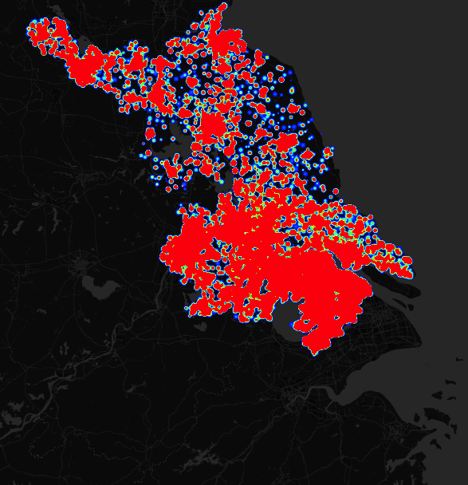

# maptalks-WebglHeatLayer
maptalks heat  on webgl

 # Support 1 Million Points

 [exmaple](https://deyihu.github.io/src/maptalks-WebglHeatLayer/examples/)

# API

 <pre>

 var data1=[],data2=[];

 data1.push({ 
                coordinates:[lng,lat],
                count:10*Math.random(),
                id:id
 });

 
 data2.push({ 
                coordinates:[lng,lat],
                count:10*Math.random(),
                id:id
 });

  var layer=new maptalks.WebGlHeatLayer('idididid',data1,{
        alphaRange: 0.2
    })
  map.addLayer(layer)

  //remove

  map.removeLayer(layer)

  //reset data

  layer.resetData(data2)

  //add data

  layer.addData(data2)

//remove data

layer.removeData(data1);

// clear

layer.clear()

 </pre>

 
